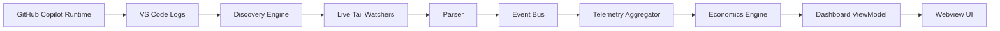
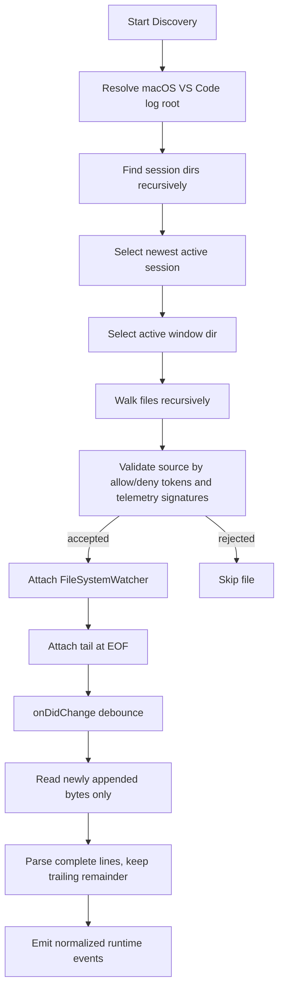
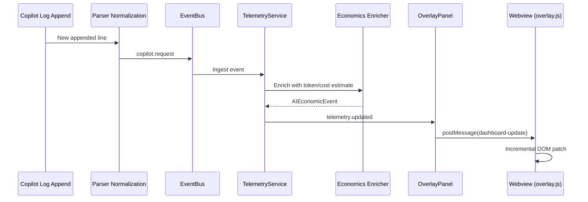
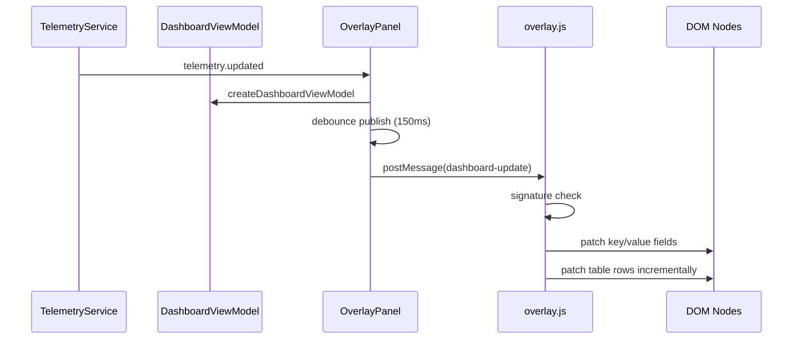

# BurnSight Architecture

This document describes the architecture currently implemented in BurnSight.

Scope:

- Realtime runtime telemetry ingestion from observable VS Code Copilot logs
- Session-scoped telemetry aggregation
- Estimated token/economics modeling
- Overlay synchronization model

Non-scope:

- Official Copilot billing API integration
- Exact provider-native token accounting
- Historical replay analytics (beyond current live stream)

## 1. System Overview

BurnSight is an event-driven extension-host pipeline.

At activation, the extension initializes:

- `EventBus` as the in-process event backbone
- `CopilotLogParser` for discovery, tailing, and parsing
- `TelemetryService` as the session telemetry authority
- `RuntimeInspector` for contextual editor/runtime signals
- `OverlayPanel` for webview publication

Operational flow:

1. Copilot runtime emits log lines into VS Code log files.
2. Discovery locates and validates relevant telemetry files.
3. Tailers read only newly appended bytes (append-only ingest).
4. Parser normalizes canonical request records.
5. Telemetry service dedupes, enriches, and aggregates session metrics.
6. Dashboard view model is published to webview with debounce.
7. Webview applies incremental DOM patches.

All cost/token outputs are observability-oriented estimates.

## 2. Mermaid Diagrams

### A. High-Level Runtime Pipeline

### B. Discovery + Tailing Flow

### C. Realtime Event Flow

### D. UI Synchronization Flow

## 3. Discovery Engine

Discovery is implemented by `CopilotLogDiscovery`.

Current behavior:

- Recursively scans VS Code log roots on macOS (`~/Library/Application Support/Code/logs`)
- Selects active session directory (timestamp-based, fallback mtime)
- Selects active window directory by telemetry recency
- Reads tail sample windows for validation (line/byte bounded)
- Validates files via `TelemetrySourceClassifier` using:
  - allow path tokens (for example `github.copilot`, `copilotmd`)
  - telemetry signature tokens (for example `ccreq:`, `request done`, `panel/editAgent`)
  - hard deny rules (BurnSight/self/output-channel paths)
- Attaches per-file watchers for accepted sources
- Uses debounced file-change callbacks before append reads

Ingestion semantics:

- First attach sets offset at EOF (no byte-0 replay)
- Subsequent reads consume only appended bytes
- Partial line tails are retained per file until completion
- Source metadata is cached per accepted file

## 4. Parser Architecture

Parser stack is split across:

- `CopilotLogParser` for file reads, relevance filters, lifecycle staging, and raw event emission
- `LogPatterns` for regex extraction primitives
- `NormalizedEventParser` for canonical `AIRequestEvent` conversion

Canonical line format handled today:

`ccreq:<id>.copilotmd | <status> | <model or model-chain> | <latency>ms | [<feature>]`

Extraction performed today:

- `ccreq` request id
- request status (`success`, `cancelled`, `error`, etc.)
- model or routed model chain
- latency ms
- workflow/feature tag (`[panel/editAgent]`, etc.)
- optional finish reason/provider markers

Higher-level detections:

- Request lifecycle boundaries (`request_start` and `request_complete` timeline phases)
- Retry detection from feature tag markers (`retry`, optional numeric suffix)
- Escalation detection from model chains (`A -> B -> C`)

Parser protections:

- Relevance gating (drop non-telemetry lines)
- Fingerprint dedupe window for repeated lines
- Self-source guardrails to avoid recursive ingestion

## 5. Telemetry Model

BurnSight telemetry uses explicit confidence classes:

- `REAL`: direct observations from runtime logs
- `ESTIMATED`: deterministic formulas built from real observations
- `HEURISTIC`: inferred signals where direct data is unavailable

Field classification (current):

- Models: `REAL` when extracted from runtime line content
- Latency: `REAL` when present as ms markers
- Retries: `REAL` when retry markers are present in workflow tag; numeric retry depth is parsed when available
- Token totals: `ESTIMATED` from deterministic token estimator inputs
- Economics: `ESTIMATED` from token estimate + pricing registry
- Runtime edit/typing AI-likeness signals: `HEURISTIC` from `RuntimeInspector`

Important separation:

- `RuntimeInspector` signals are contextual/debug signals and do not drive core accounting counters
- Accounting is performed only on normalized/deduped Copilot request events

## 6. Economics Engine

Economics pipeline:

1. `NormalizedEventParser` outputs `AIRequestEvent`
2. `TokenEstimator` computes input/output/total estimated tokens
3. `CostEstimator` applies pricing lookup and estimates USD cost
4. `EconomicsAggregator` accumulates session totals and burn metrics

Implemented token modeling inputs:

- Approximate chars-to-token base (`chars / 4` heuristic)
- Latency-derived throughput estimate
- Model profile multipliers (`avgTokensPerSecond`, `reasoningMultiplier`, `outputBias`, `orchestrationMultiplier`)
- Workflow multipliers (`inputMultiplier`, `outputMultiplier`, `orchestrationMultiplier`, `retryPenalty`)
- Retry amplification (based on retry count)
- Escalation amplification (based on model-chain hops)
- Status output factor (success vs non-success)

Pricing model:

- Uses provider pricing registry entries for OpenAI/Anthropic/Google model matches
- Falls back to unknown-model heuristic pricing when no direct match exists
- Produces per-model and per-workflow estimated cost totals

Explicit caveat:

All economics are estimated observability metrics and are not authoritative billing values.

## 7. Session Isolation

Current session behavior:

- Discovery scopes to currently active VS Code log session/window
- Tailing is append-only from attach-time EOF
- Processing is live-session-oriented (no full historical replay)
- Deduping guards against re-read inflation by request/source/offset keys

Session state model:

- `ACTIVE` after observed Copilot request activity
- `IDLE` after inactivity timeout window

## 8. UI Architecture

UI pipeline components:

- `TelemetryService` builds `OverlaySnapshot`
- `OverlayPanel` maps state to `DashboardViewModel`
- `OverlayPanel` sends debounced `postMessage` payloads to webview
- `overlay.js` performs signature checks and incremental DOM patching

Implementation details:

- Webview is opened as a retained context panel
- Ready handshake (`dashboard:ready`) gates message sending
- Payload dedupe avoids repeated identical renders
- Table rows are keyed and synchronized incrementally
- Static HTML template is rendered once; runtime updates patch nodes

Debounce strategy:

- TelemetryService webview emission debounce: `120ms`
- OverlayPanel viewmodel publish debounce: `150ms`

## 9. Performance Protections

Current performance and correctness protections include:

- Append-only file reads via tracked byte offsets
- EOF attach semantics to avoid startup historical replay
- Line fingerprint dedupe windows in parser
- Request/source/offset dedupe in event deduper
- Debounced watcher callbacks and UI updates
- Bounded buffers for recent events and timeline history
- Watcher lifecycle management with disposal on teardown
- Source validation cache to avoid repeated expensive scans

## 10. Known Limitations

Known limitations in the current architecture:

- No official Copilot token or billing API is used
- Token and economics outputs are estimates, not billing truth
- Telemetry format changes in VS Code/Copilot can break parsers
- Model/provider detection is limited to observable markers in logs
- Current discovery root implementation is macOS-only
- Session analytics are live-stream-focused, with limited historical context

## 11. Future Evolution

Realistic next phases:

- Windows/Linux log discovery support
- Historical session persistence and trend analytics
- Provider abstraction and richer model mapping
- Improved workflow intelligence and routing analytics
- Charted timelines and comparative burn analysis
- Broader multi-provider telemetry support where observable signals exist